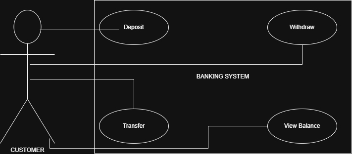

# OOP Banking System Project Report

## Student Information
* **Name:** Hüseyin Fidan
* **Student ID:** 220303006
* **Course:** Object Oriented Programming
* **Date:** 05.01.2026

## 1. Introduction
This project aims to develop a basic **Banking System** using Java and **Object-Oriented Programming (OOP)** principles. The system allows users to manage different types of accounts (Savings and Checking), perform transactions like deposit, withdraw, and money transfer.

The main goal is to demonstrate core OOP concepts such as:
* **Encapsulation:** Protecting account balance.
* **Inheritance:** Creating specific account types from a base class.
* **Polymorphism:** Overriding methods for different behaviors.
* **Abstraction:** Using abstract classes and interfaces.

## 2. Requirements Analysis
### Functional Requirements
The system supports the following operations:
1. **Account Creation:** Users can open Savings or Checking accounts.
2. **Deposit:** Adding funds to any account.
3. **Withdraw:** Removing funds with specific validation rules (e.g., overdraft limit for Checking accounts).
4. **Transfer:** Sending money between two accounts securely using the `Transferable` interface.
5. **Balance Inquiry:** Viewing the current balance of an account.

### Non-Functional Requirements
* The system is built using **Java**.
* It follows strict **OOP principles** (Inheritance, Polymorphism).
* Code is organized into packages (`model`, `app`, `test`).
* Unit tests are implemented using **JUnit**.

## 3. System Design
The system architecture is designed based on standard UML practices.

### 3.1 Use Case Diagram
The following diagram illustrates the interaction between the Customer (Actor) and the Banking System operations.

### 3.2 Class Diagram
The class diagram shows the structure of the classes and their relationships (Inheritance, Aggregation, Implementation).

## 4. Implementation Details
### Class Structure
* **`Account` (Abstract Class):** The base class containing common attributes (`balance`, `ownerName`) and abstract methods like `withdraw()`.
* **`Transferable` (Interface):** Defines the `transfer()` contract, ensuring loose coupling.
* **`SavingsAccount`:** Implements strict withdrawal logic (no overdraft allowed) and includes an interest rate attribute.
* **`CheckingAccount`:** Overrides `withdraw()` to allow overdrafts up to a specific limit.
* **`Bank`:** Manages a collection of accounts using `List<Account>`.

### Polymorphism in Action
Polymorphism is demonstrated in the `Main` class where `Account` references hold objects of `SavingsAccount` and `CheckingAccount`. The `withdraw()` method behaves differently depending on the object type at runtime.

